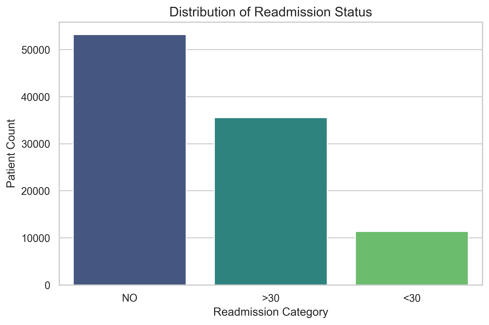

<div align="center">

# 🏥 Patient Risk Readmission Prediction

**A comprehensive data analytics framework to predict early hospital readmission (<30 days) for diabetic patients using custom clinical risk scoring.**

[](https://www.python.org/)
[](https://jupyter.org/)
[](https://pandas.pydata.org/)
[](https://seaborn.pydata.org/)

</div>

<br>

<div align="center">
  
</div>

---

## 📖 About The Project

Early hospital readmission is a critical metric for healthcare quality. Readmissions within 30 days of discharge often point to clinical complications, high-risk conditions, or the need for escalated medical care. 

This project tackles this challenge by processing complex Electronic Medical Records (EMR) for diabetic patients and developing a custom **VCI (Vulnerability, Complexity, and Intensity) Risk Score**. This algorithm accurately categorizes patients into **Low, Medium, and High-Risk** stratums, allowing medical professionals to optimize resource allocation and aftercare planning.

---

## ⚡ Key Analytical Phases

- 🧹 **Phase 1: Data Engineering & Cleaning**  
  Aggressively cleaned missing data (e.g., dropping the sparse `weight` column), purged deceased patient records, mapped encoded clinical variables, and formatted the dataset for integrity.
  
- 🌐 **Phase 2: Automated ICD-9 Web Scraping**   
  Integrated a lightweight web scraper using `BeautifulSoup4` to automatically fetch high-level medical descriptions for primary diagnosis ICD-9 codes, enriching the raw dataset with human-readable conditions.

- 📊 **Phase 3: Exploratory Data Analysis (EDA)**  
  Extracted deep clinical insights analyzing relationships such as *Insulin Use vs. Alternate Meds*, *Dosage Change Impacts*, *Demographic Overlaps*, and *Operational Correlations* (stay length vs. lab procedures).
  
- 🧮 **Phase 4: VCI Risk Score Architecture**  
  Engineered an aggregate clinical metric by scoring the patient's **L**ength of stay, **A**cuity of admission, **C**omorbidity (number of diagnoses), and **E**mergency visit history. 

---

## 📂 Repository Structure

| File / Folder | Description |
| :--- | :--- |
| 📓 `health.ipynb` | The core Jupyter Notebook containing all data cleaning, scraping, EDA, and logic. |
| 🗃️ `diabetic_data.csv` | The raw baseline dataset containing clinical patient encounters. |
| 🗂️ `IDs_mapping.csv` | Key dictionary utilized to map numeric database IDs to readable text. |
| 💾 `final_processed_diabetic_data.csv` | Clean, pipeline-ready data generated with full mappings and VCI scores attached. |
| 📈 `Project_Charts/` | Directory containing high-quality rendered statistical visualizations. |

---

## 🚀 Quick Start & Usage

To run the analysis natively on your machine, ensure you have Python 3 installed along with the required analytical libraries.

1. **Clone the repository:**
   ```bash
   git clone https://github.com/Matheesha-Abiman/Patient-Risk-Readmission-Prediction.git
   cd Patient-Risk-Readmission-Prediction
   ```

2. **Install required dependencies:**
   ```bash
   pip install pandas numpy seaborn matplotlib beautifulsoup4 requests
   ```

3. **Launch the Notebook:**
   ```bash
   jupyter notebook health.ipynb
   ```
   > *Note: Execute the cells sequentially to watch the data clean itself, fetch live ICD-9 data, and generate the phase views directly into the `Project_Charts` folder.*

---

<div align="center">
  <i>Developed with ❤️ for predictive healthcare analytics.</i>
</div>
